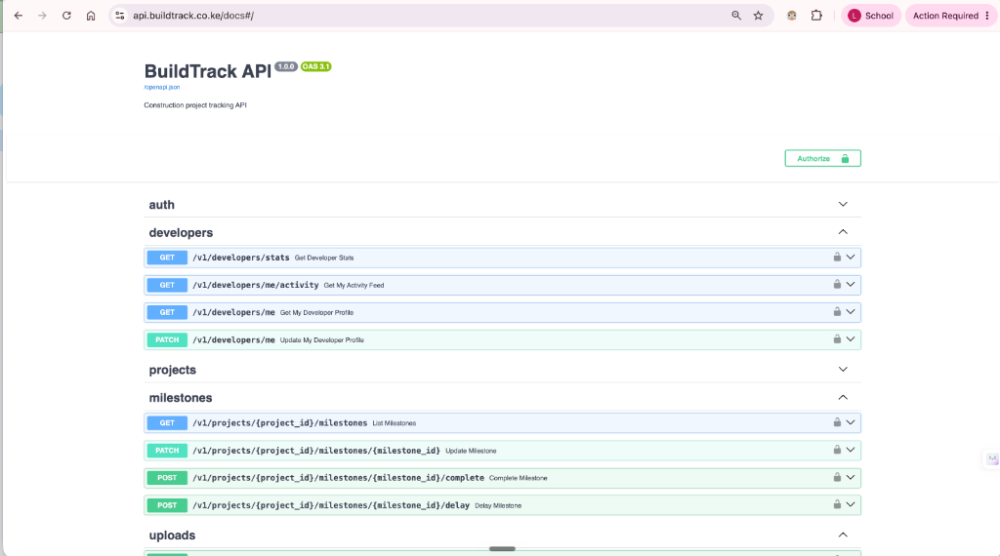

# BuildTrack Backend


<br>

<br>

REST API for BuildTrack. Property developers upload GPS-verified construction photos; a BuildTrack admin reviews and approves them before buyers can see any update.

## What it does

- Multi-tenant: each developer company is fully isolated
- GPS-gated uploads validated against project site coordinates
- Upload approval workflow: all uploads sit in pending review until an admin approves
- Buyers access their project via email invitation or a public project code
- Email notifications sent to all buyers on each approved upload
- JWT access tokens (15 min) + httpOnly refresh cookies (14 days)
- Role enforcement: `admin`, `developer`, `buyer` with full audit log

## Tech stack

| Layer | Choice |
|---|---|
| Framework | FastAPI + Uvicorn |
| ORM | SQLAlchemy 2 async + asyncpg |
| Database | PostgreSQL via Neon |
| Migrations | Alembic |
| Storage | Cloudinary (signed direct uploads) |
| Email | smtplib using Gmail SMTP |
| Validation | Pydantic v2 |
| Logging | structlog |
| Hosting & CI/CD | Render (Automatic deploys via GitHub pushes) |

## Local setup

Requires Python 3.12, a PostgreSQL database (Neon free tier works), a Cloudinary account, and a Resend account.

```bash
git clone https://github.com/BuildTrack-Company/buildtrackbackend.git
cd buildtrackbackend

python -m venv .venv
.venv\Scripts\activate        # Windows
# source .venv/bin/activate   # macOS / Linux

pip install -e .

cp .env.example .env
# Edit .env and fill in every value (including GMAIL_APP_PASSWORD)

alembic upgrade head
python scripts/seed_dev.py

uvicorn app.main:app --reload --port 8000
```

Interactive API docs: `http://localhost:8000/docs`

## Scripts

Helpful utility scripts are stored in the `scripts/` directory:
- `scripts/seed_dev.py` - Seeds initial database mock data
- `scripts/test_emails.py` - Tests the SMTP email pipeline
- `scripts/trigger_emails.py` - Triggers manual email notifications
- `scripts/test_templates.py` - Validates email Jinja templates

## Environment variables

| Variable | Description |
|---|---|
| `DATABASE_URL` | asyncpg connection string |
| `CLOUDINARY_CLOUD_NAME` | Cloudinary cloud name |
| `CLOUDINARY_API_KEY` | Cloudinary API key |
| `CLOUDINARY_API_SECRET` | Cloudinary API secret |
| `RESEND_API_KEY` | Resend transactional email key |
| `JWT_SECRET_KEY` | Random string, minimum 32 characters |
| `INTERNAL_CRON_TOKEN` | Shared secret for cron endpoints |

See `.env.example` for the full list.

## Key files

```
app/
  main.py                    FastAPI app, middleware, router registration
  core/
    config.py                Settings loaded from .env
    deps.py                  Auth dependencies: get_current_user, TenantContext
    security.py              JWT encode/decode, bcrypt hashing
  modules/
    auth/                    Login, register, refresh, password reset
    developers/              Developer profile and dashboard stats
    projects/                Project CRUD
    milestones/              Milestone status, complete, delay actions
    uploads/                 Upload sessions, finalize, admin review
    buyers/                  Invite, bulk invite, self-register by code
    admin/                   Admin review queue, audit log, platform stats
    notifications/           Email fan-out on approved uploads
    billing/                 Subscription tier limits
    internal/                Cron job endpoints (trial warnings, usage sync)
    webhooks/                Resend and Brevo delivery status webhooks
  shared/
    audit.py                 log_action() called after every write operation
    storage.py               Cloudinary signed upload param generation
    email.py                 send_email() wrapper around Resend
    response.py              ok() and paginated() response envelope
    geo.py                   haversine_metres() for GPS distance validation
alembic/versions/            Database migrations
scripts/seed_dev.py          Seeds local DB with test accounts and project
```

## Seed accounts

After running `scripts/seed_dev.py`:

| Role | Email | Password |
|---|---|---|
| Admin | admin@buildtrack.co.ke | Admin@2026! |
| Developer | developer@acme.co.ke | Developer@2026! |
| Buyer | buyer1@test.com | Buyer@2026! |
| Buyer | buyer2@test.com | Buyer@2026! |
